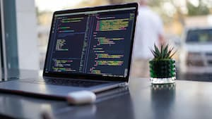

# hola-code

## Introduction
Hello, I'm Sarah (she/her) 👋. I'm making a career pivot to software development from social work/education/digital marketing.
[Here's the link to my GitHub porfolio.](https://github.com/s-glass)

## What This Site Is About
This website is dedicated to my work in Code Fellows' Code 102 course.

## Table of Contents

### Code 102 Labs

* [Class 3 Lab - Pixel the Cat in HTML](https://s-glass.github.io/hola-code/index)
